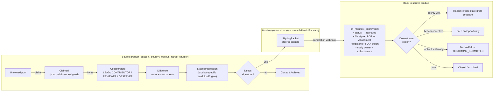

# DockLabs Engineering Principles

These principles ensure consistency across the DockLabs suite (Admiralty, Beacon, Bounty, Harbor, Helm, Lookout, Manifest, Purser, Yeoman). When working on any product, verify compliance and flag deviations.

## Session & Machine Context

### How Claude accesses this codebase
- **Claude Code** (run from Mac mini or laptop): Has full filesystem access to `/Users/dok/Code/CT/`. Use this for all code reading, editing, and terminal commands.
- **claude.ai chat interface**: The `bash_tool` runs in a remote sandboxed container — it has NO access to the local filesystem regardless of which physical machine Dan is using. SSH from that container to the Mac mini is blocked by egress restrictions.

### Machine setup
- **Mac mini (dispatch)**: M4 Pro, Tailscale IP `100.122.119.51`, SSH alias `macmini`, user `dok`. Primary dev machine. All DockLabs repos at `/Users/dok/Code/CT/`.
- **Laptop**: Also has the repos, synced via GitHub. Either machine may be the source of a claude.ai message.
- **Code is synced via GitHub** — the canonical source is always the same. There is no meaningful difference between "macmini code" and "laptop code" as long as both are up to date.

### What Claude should do at the start of each session
1. **Do not assume bash_tool works on the local machine** — it never does in claude.ai.
2. **Ask Dan to confirm the session type** if it's ambiguous whether he's in Claude Code or claude.ai chat, since capabilities differ significantly.
3. **When in Claude Code**: read `keel/CLAUDE.md` and relevant app `CLAUDE.md` files before responding to code questions.
4. **When in claude.ai chat**: work from memory/context; ask Dan to paste files or use `git show` output if code review is needed.

## Deployment Flexibility — Solo, Partial, or Full Suite

**Core principle:** Every DockLabs product MUST be deployable in any combination — standalone (one product, no peers), partial (a subset like Harbor + Beacon), or full suite (all 9 products + Helm + Keel). A customer buying only Harbor gets a fully functional Harbor. A customer adding Beacon later gets the cross-product features automatically. No feature should hard-require a peer product to be deployed.

### What this means in practice

1. **Every cross-product dependency is optional.** Environment variables that reference peer products (e.g. `BEACON_INTAKE_URL`, `HELM_FEED_API_KEY`) must be optional. Code paths that call peers must wrap the call in a try/except or pre-check and gracefully no-op when the env var is unset.
2. **Gate UI, not just wire calls.** Cross-product action controls (e.g., "Add to Beacon" buttons, fleet switcher entries, Helm feed cards) must be HIDDEN when the peer isn't configured. Don't render a button that silently no-ops or 404s. Use an `is_available()` helper per integration.
3. **Fleet switcher is dynamic.** `KEEL_FLEET_PRODUCTS` is the full list, but the template filters it to "only products this customer has deployed" based on env-var presence. A Harbor-only customer sees no fleet switcher (or just Harbor).
4. **Standalone auth fallback.** Every product must support local auth + direct Microsoft SSO when `KEEL_OIDC_CLIENT_ID` is unset. `AutoOIDCLoginMiddleware` only intercepts when OIDC is configured. Login templates show the right buttons based on what's available.
5. **Standalone database.** No cross-product foreign keys. All cross-product references are string slugs + URLs (see "Cross-Product Linkage" below). A product deployed alone has no cross-product rows.
6. **Suite-mode features are additive.** FOIA export to Admiralty, Helm feed publishing, Yeoman-to-Beacon contact creation, etc. all enrich the experience when peers exist but cause zero degradation when they don't.
7. **Shared CSS/design system ships with every product.** The `keel` pip package carries shared CSS, fonts, and components. Every product consuming keel gets the full design system, whether it's deployed alone or with 8 peers. No customer is stuck on a stripped-down visual.
8. **Demo mode works for any subset.** `DEMO_MODE=true` must seed the product's own demo data without requiring peer products. `seed_keel_users` reads from the local `PRODUCT_ROLES` entry for that product only.

### Testing standalone-ness

Before any feature ships that adds cross-product integration, verify:
- [ ] Product boots with peer env vars unset
- [ ] UI renders without peer-dependent controls
- [ ] No 500s, no silent no-op buttons, no broken links in the rendered HTML
- [ ] `DEMO_MODE=true` seeds work without peer products

**Why:** Selling DockLabs to agencies means different customers need different subsets. A CT-only agency buys Harbor + Admiralty. A larger customer takes the full suite. A pilot might start with just Beacon. Architectural decisions that assume "all 9 are always deployed" break the sales motion and force redeployment churn every time a customer adds a product. Standalone-ness is a product requirement, not an engineering nicety.

## Authentication & Identity

### Suite SSO — Keel as the OIDC Identity Provider (Phase 2b)

- **Keel is the canonical identity provider for the suite.** Users authenticate once against `https://keel.docklabs.ai` via OAuth2 / OpenID Connect, and each DockLabs product is a registered OIDC client. The old cookie-based cross-domain SSO (shared `SESSION_COOKIE_DOMAIN=.docklabs.ai`) was a stopgap and is being decommissioned.
- **Implementation:** Keel uses `django-oauth-toolkit>=2.4`. The IdP module lives at `keel/oidc/` and mounts under `/oauth/`:
  - `/oauth/authorize/` — authorization code flow with PKCE (S256)
  - `/oauth/token/` — token endpoint, 1h access / 14d refresh, rotation enabled
  - `/oauth/userinfo/`
  - `/oauth/.well-known/openid-configuration`
  - `/oauth/.well-known/jwks.json` (RS256 public key)
- **Required Keel env vars:**
  - `KEEL_OIDC_PRIVATE_KEY` — RSA 2048 PEM (generate with `openssl genrsa 2048`). Dev mode auto-generates an ephemeral key when `DEBUG=True`.
  - `KEEL_OIDC_ISSUER` — e.g. `https://keel.docklabs.ai`
- **Custom JWT claims.** `keel.oidc.validators.KeelOIDCValidator` emits a `product_access` claim that maps product codes to roles:
  ```json
  {"product_access": {"helm": "system_admin", "harbor": "analyst", ...}}
  ```
  plus `email`, `name`, `given_name`, `family_name`, `preferred_username`, `is_state_user`, `agency_abbr`. The `product_access` scope is declared in `OAUTH2_PROVIDER['SCOPES']`.
- **Products are OIDC clients** via `allauth.socialaccount.providers.openid_connect`. Each product's `settings.py` registers a provider under the `keel` provider_id when `KEEL_OIDC_CLIENT_ID` is set:
  ```python
  INSTALLED_APPS += ['allauth.socialaccount.providers.openid_connect']
  SOCIALACCOUNT_ADAPTER = 'keel.core.sso.KeelSocialAccountAdapter'
  SOCIALACCOUNT_LOGIN_ON_GET = True  # skip allauth's "Continue?" page
  if KEEL_OIDC_CLIENT_ID:
      SOCIALACCOUNT_PROVIDERS['openid_connect'] = {
          'APPS': [{
              'provider_id': 'keel',
              'name': 'Sign in with DockLabs',
              'client_id': KEEL_OIDC_CLIENT_ID,
              'secret': KEEL_OIDC_CLIENT_SECRET,
              'settings': {
                  'server_url': f'{KEEL_OIDC_ISSUER}/oauth/.well-known/openid-configuration',
                  'token_auth_method': 'client_secret_post',
                  'oauth_pkce_enabled': True,  # Keel requires PKCE
              },
          }],
      }
  ```
- **Per-product Railway env vars:** `KEEL_OIDC_CLIENT_ID`, `KEEL_OIDC_CLIENT_SECRET`, `KEEL_OIDC_ISSUER`. Unset the first two to fall back to local auth + direct Microsoft SSO (standalone mode still works for dev).
- **Registering a new product as an OIDC client:** run a Django shell against the Keel DB and create an `oauth2_provider.models.Application` with `client_type=confidential`, `authorization_grant_type=authorization-code`, `algorithm=RS256`, `skip_authorization=True`, and `redirect_uris=https://<host>/accounts/oidc/keel/login/callback/`. Set `client_id` and `client_secret` explicitly before `.save()` so you can capture the cleartext — allauth hashes `client_secret` on save. Yeoman uses `/auth/` instead of `/accounts/`, so its redirect is `https://yeoman.docklabs.ai/auth/oidc/keel/login/callback/`.
- **Session claim handoff.** `KeelSocialAccountAdapter.pre_social_login` stashes the claims into `request.session['keel_oidc_claims']` so `ProductAccessMiddleware` reads the per-product role from the claim instead of hitting the DB. `save_user` / returning-user branches also mirror the full `product_access` dict into `ProductAccess` rows so Keel-admin role changes propagate to products on the next login.
- **Extracting OIDC claims.** allauth nests them under `extra_data['userinfo']` and `extra_data['id_token']` (NOT the top level). Use `keel.core.sso._extract_keel_claims()` which prefers userinfo, falls back to id_token, and merges `product_access` from the signed token when userinfo is missing it.
- **Login card buttons.** Every product's shared `keel/login_card.html` shows **both** "Sign in with DockLabs" (Keel OIDC) and "Sign in with Microsoft" (direct Entra) when configured. The context processor `keel.core.context_processors.site_context` injects `keel_login_url` via `reverse('openid_connect_login', {'provider_id': 'keel'})` — do NOT use the provider registry, it's unreliable for dynamic OIDC apps in allauth 65.
- **`oidc_claim_scope` mapping is REQUIRED for custom claims.** django-oauth-toolkit's `OAuth2Validator.get_oidc_claims` filters every claim through `oidc_claim_scope`: a claim is only included in the issued ID token when the scope it maps to is present in the client's requested scopes. The base mapping only covers standard OIDC profile/email/address/phone claims. `KeelOIDCValidator` extends it to register `product_access`, `is_state_user`, and `agency_abbr` under the `product_access` scope. **If you add a new custom claim, you MUST add it to `oidc_claim_scope` on the validator class, or it will be silently stripped from every token.**
- **Products MUST request the `product_access` scope.** Each product's openid_connect APP settings must include `'scope': ['openid', 'email', 'profile', 'product_access']`. Without this, Keel scrubs the claim even though the validator returns it.
- **`dokadmin`** on Keel is the canonical superuser with `system_admin` `ProductAccess` for all 10 products. Email is `dok@dok.net`. Keel uses Django's native auth (username/password), not allauth — there's no Microsoft SSO on Keel itself. Products link to the local `dokadmin` user via `preferred_username` from the JWT (see adapter notes below), not by email.
- **User linking uses `preferred_username` first, email second.** `KeelSocialAccountAdapter.pre_social_login` matches the JWT's `preferred_username` claim against the local DB's `username` field FIRST, then falls back to email. This prevents the "zombie dan/dan2/dan3" pattern where allauth creates a new user from `given_name`+`family_name` when email doesn't match a legacy account. `populate_user` also unconditionally sets `user.username = preferred_username` from the JWT, overriding allauth's default name-derived username.
- **`AutoOIDCLoginMiddleware`** intercepts unauthenticated GET/HEAD requests to `/accounts/login/` (or `/auth/login/`) carrying a `?next=` query param and 302s them into the Keel OIDC flow. This makes fleet-switcher navigation seamless: clicking Harbor from Helm bounces through Keel's `/oauth/authorize/` (which already has a session) and lands on Harbor's dashboard without showing a login form. Direct visits to `/accounts/login/` without `?next=` still render the form. Active only when `KEEL_OIDC_CLIENT_ID` is set; respects `DEMO_MODE` (demo instances skip auto-OIDC).
- **`SuiteLogoutView`** chains product logout through Keel's `/suite/logout/` endpoint so the IdP session is also cleared. Accepts both GET and POST (Django 5's LogoutView requires POST by default, but users need a way to break out of stale sessions via link click). Demo instances chain through `demo-keel.docklabs.ai` automatically based on the Host header.
- **Message suppression.** `KeelAccountAdapter.add_message` suppresses "Successfully signed in as X" and "Signed out" toasts suite-wide — SSO users don't need to see these on every product switch. Suppression works by both template path (`SUPPRESSED_MESSAGE_TEMPLATES`) and rendered text substring (`SUPPRESSED_MESSAGE_SUBSTRINGS`). If allauth changes its message path in a future version, the substring filter catches it.

### Core identity rules (apply in all modes)

- **KeelUser is the canonical user model.** All products use `AUTH_USER_MODEL = 'keel_accounts.KeelUser'` with `keel.accounts.middleware.ProductAccessMiddleware`. All 9 products (including Admiralty) have been migrated.
- **SSO adapter:** Use `keel.core.sso.KeelAccountAdapter` and `keel.core.sso.KeelSocialAccountAdapter`. Do not create product-specific SSO adapters. `KeelAccountAdapter.get_login_redirect_url` resolves from `settings.LOGIN_REDIRECT_URL` (which MUST be `/dashboard/` — see Canonical URLs below). `KeelAccountAdapter.send_confirmation_mail` short-circuits when `keel_oidc_claims` is in the session so OIDC logins don't try to send a verification email.
- **Shared login form:** `keel.accounts.forms.LoginForm` provides a styled `AuthenticationForm` with "Username or email" / "Password" fields carrying `class="form-control"`. Every product's login URL wires this into the `authentication_form` kwarg so input fields render with Bootstrap styling. Do not fall back to Django's bare `AuthenticationForm` — the inputs render unstyled.
- **Shared auth templates:** Keel provides all auth templates in `keel/core/templates/account/` (login, signup, logout, password reset, email confirm, etc.). Products inherit these automatically via `APP_DIRS`. Product branding (icon, name, subtitle, demo mode) is driven entirely by `KEEL_PRODUCT_NAME`, `KEEL_PRODUCT_ICON`, `KEEL_PRODUCT_SUBTITLE` settings — do not create product-specific login pages.
- **Roles:** Define product-specific roles in `keel.accounts.ProductAccess`, not on the User model. `KeelUser.get_role_display()` humanizes the raw role string (e.g. `system_admin` → `System Admin`) using `ROLE_LABELS` with auto-title-case fallback. In `DEMO_MODE`, it prepends "Demo" (→ "Demo System Admin"). The shared sidebar calls `{{ user.get_role_display }}` — do not use `{{ user.role }}` directly in templates.

**Why:** Split identity prevents cross-product SSO, complicates Helm's executive dashboard, and creates maintenance burden with N copies of auth logic. OIDC also eliminates the cookie-domain fragility that kept invalidating dokadmin sessions on every `SECRET_KEY` rotation.

### User Provisioning Rules

- **Three deployment modes.** `keel.core.utils.is_suite_mode()` is the canonical detector. Returns `True` only when `KEEL_OIDC_CLIENT_ID` is set AND `DEMO_MODE` is false. Use it before branching on deployment topology.
  - **Standalone** (`KEEL_OIDC_CLIENT_ID` unset): local signup works if `KEEL_ALLOW_SIGNUP=True`. Django admin user creation works normally. Users exist only in that product's DB.
  - **Suite** (suite_mode=True): **public signup is force-closed**, and **Django admin blocks "+ Add user"**. All user creation happens in Keel's admin, then OIDC auto-links on first SSO. A user created in an individual product admin under suite mode lives only in that product's DB, has no Keel `SocialAccount` link, and can never SSO — an invisible failure.
  - **Demo** (`DEMO_MODE=True`): signup + admin work regardless. Demo users are seeded via management commands.
- **`dokadmin` is the canonical bootstrap superuser.** Every product auto-creates it on startup via `keel.core.startup.run_startup()` → `manage.py ensure_dokadmin`, unconditional of DEMO_MODE. Without dokadmin, SSO 403s with "Signup currently closed" because allauth can't auto-create on a closed-signup adapter. The command is idempotent: re-running is a no-op. Set `DOKADMIN_EMAIL` env var to override the default `dok@dok.net`.
- **Migrating existing local users into the suite.** `pre_social_login()` auto-links by `preferred_username` first, then email. So the flow is: (1) create the user in Keel admin with the same username, (2) add `ProductAccess` rows, (3) user logs into the product via "Sign in with DockLabs" → accounts auto-link. No manual per-product user creation needed.
- **Never create users in individual product admins when deployed as a suite.** The Django admin "+ Add user" button is blocked and shows a suite-mode banner to reinforce this. Use Keel's admin (https://keel.docklabs.ai/admin/) as the single pane for user identity + product access.

**Why:** Prevents the "orphan local user" footgun — a user created in Beacon's admin can only reach Beacon and can't SSO. Keeping all user creation in Keel keeps identity coherent across the fleet.

## Demo Mode

### Architecture

**The demo site runs the exact same code as production.** There is one git branch, one image, one set of models, one set of URLs. The only thing that changes between `<product>` and `<product>-demo` is configuration:

| Axis | Production | Demo |
|---|---|---|
| Git repo / branch | `main` | `main` (same commit, auto-deployed together) |
| Railway project | `<product>` | `<product>` (same project) |
| Railway service | `<product>` | `<product>-demo` |
| Postgres **service** | shared | shared (one container) |
| Postgres **database** | `railway` | `<product>_demo` (separate DB on the same server) |
| Hostname | `<product>.docklabs.ai` | `demo-<product>.docklabs.ai` |
| `DEMO_MODE` env var | unset | `True` |
| OIDC client ID | points at `keel.docklabs.ai` | points at `demo-keel.docklabs.ai` |
| Logout chain endpoint | `keel.docklabs.ai` | `demo-keel.docklabs.ai` (auto-detected from Host) |

**Why two services, not one process with a flag?** Isolation. A bad deploy on demo doesn't take prod down. A failed migration on demo doesn't block the prod service. Env-var secrets (Manifest tokens, webhook secrets, API keys) are scoped per service. Demo can be paused or redeployed independently while prod iterates.

**Why two databases, not one with a tenant column?** Seed data. `run_startup()` auto-seeds demo users + domain data when `DEMO_MODE=True` and the DB is empty — if demo shared prod's DB, the seed would either corrupt production data or require complex scoping. Separate DBs let demo be wiped and reseeded freely while prod stays stable.

This is what lets a customer with only `harbor` purchased buy only the `harbor` service (no demo service at all) and still get a functional Harbor. Demo is a deployment pattern, not a code branch.

### What `DEMO_MODE=True` changes at runtime

- **`DEMO_MODE=True`** activates demo branding and seed data across the suite.
- **Product name:** `site_context` appends " Demo" to `SITE_NAME` so the sidebar brand reads "Harbor Demo", "Beacon Demo", etc.
- **Role display:** `get_role_display()` prepends "Demo" to every role label (→ "Demo System Admin", "Demo Analyst").
- **Seed data:** `keel.core.startup.run_startup()` auto-seeds demo users and domain data when `DEMO_MODE=True` and the DB is empty. Demo sites (`demo-*.docklabs.ai`) use this; production sites (`*.docklabs.ai`) do NOT.
- **AutoOIDCLoginMiddleware** skips auto-OIDC redirect in `DEMO_MODE` so demo users can log in via the local form with demo credentials.
- **`SuiteLogoutView`** chains through `demo-keel.docklabs.ai` (not `keel.docklabs.ai`) on demo instances, auto-detected from the Host header.
- **Dashboard greeting:** Only Helm shows a "Welcome back" greeting (auto-fades after 4s, once per session). Other products show just "Dashboard" as the page header — no per-product greeting in suite mode.

## Canonical URLs

- **Every product exposes `/dashboard/` as its canonical post-login URL.** This is a hard requirement — set `LOGIN_REDIRECT_URL = '/dashboard/'` in every product's settings and mount the **real** dashboard view at `/dashboard/` (not a `RedirectView` — the browser URL bar must stay at `/dashboard/`, not bounce to `/helm/` or `/packets/` or `/foia/dashboard/`).
- For products whose dashboard view lives at a different historical path, import the view directly and mount it a second time at `/dashboard/` with `name='dashboard_alias'`:
  ```python
  # helm_site/urls.py
  from dashboard.views import DashboardView
  urlpatterns = [
      path('helm/', include('dashboard.urls')),  # legacy path
      path('dashboard/', DashboardView.as_view(), name='dashboard_alias'),
  ]
  ```
- **`KEEL_FLEET_PRODUCTS` urls must end in `/dashboard/`.** The fleet switcher sends users between products; any entry ending in `/` dumps them on the public landing page. The canonical list is baked into each product's `settings.py`:
  ```python
  KEEL_FLEET_PRODUCTS = [
      {'name': 'Helm', 'label': 'Helm', 'code': 'helm', 'url': 'https://helm.docklabs.ai/dashboard/'},
      {'name': 'Harbor', 'label': 'Harbor', 'code': 'harbor', 'url': 'https://harbor.docklabs.ai/dashboard/'},
      # ... all 9 products
  ]
  ```
- **`LandingView.authenticated_redirect`** must be a URL name that resolves to `/dashboard/` (e.g. `'dashboard_alias'` on products that use the alias pattern, or `'dashboard:index'` on Helm). A plain `'dashboard'` fails with `NoReverseMatch` on products where the URL name is namespaced.

**Why:** Users navigate between products constantly. A single canonical entry URL prevents 404s from fleet-switcher clicks and makes the suite feel coherent.

## UI & Frontend

- **CSS:** Use `keel/core/static/css/docklabs.css` (and the v2 successor `docklabs-v2.css`) as the shared design system. Product-specific CSS should only add product-unique components (e.g., `harbor.css` for grant cards), never override shared styles.
- **Bootstrap 5.3.3** via CDN. Do not pin different Bootstrap versions across products.
- **NEVER use `opacity: 0` in CSS animations with `animation-fill-mode: both`.** The `both` fill mode starts elements at the `from` state — if that state includes `opacity: 0`, elements are invisible until the animation fires. If the animation doesn't fire (backgrounded tab, render race, slow paint), elements stay permanently invisible. The `fadeUp` animation in `docklabs-v2.css` was fixed in 0.11.10 to use only `transform` (no opacity). If you add new animations, ensure elements are always visible by default.
- **Flex layout: `.dl-main` uses `flex: 1 1 auto`, not `flex: 1`.** The shorthand `flex: 1` resolves to `flex: 1 1 0` (flex-basis: 0). Combined with `overflow-y: auto`, some browsers compute the flex item's width as 0 because the auto overflow creates a new formatting context with no intrinsic size from the zero basis. Use `flex: 1 1 auto` so the element's natural size is the starting point. This was a suite-wide layout bug fixed in keel 0.11.13.
- **Do not use `overflow: hidden` on `.card`.** It clips Poppins font ascenders in card headers. The `overflow: hidden` was originally there for border-radius clipping, but modern browsers handle that without it. Removed in keel 0.11.11.
- **Page headers inside grid columns.** On detail pages (company, contact), the page title + action buttons must be inside the `col-lg-8` grid column, not above the `row g-4`. Otherwise the header spans a different width than the content cards and the layout is misaligned. Use `d-flex justify-content-between` with the title on the left and icon-only `btn-sm` action buttons on the right.
- **Page-header action buttons — labeled primary + icon-only outline + dropdown overflow.** Dashboards and list pages MUST render primary actions in the page header (top-right), not as a "Quick Actions" sidebar card. Pattern: one labeled `btn-sm btn-primary` for the most common action, 1–2 icon-only `btn-sm btn-outline-primary` with `title="…"` tooltips for secondary actions, and any remaining actions collapsed into a `btn-outline-secondary` dropdown (`<i class="bi bi-three-dots">`). The shared `d-flex justify-content-between align-items-center mb-4` header wraps the title on the left and a `d-flex align-items-center gap-2` action row on the right. Do not re-introduce full-width "Quick Actions" cards in the sidebar — the suite convention was moved to the header in keel 0.11.14.
- **Icon-only buttons MUST carry a `title` attribute.** The shared JS in `docklabs-v2.js` auto-upgrades every `.btn[title]` to a Bootstrap tooltip on page load (unless the button is a dropdown toggle), so icon-only actions get a styled hover label without each template having to add `data-bs-toggle="tooltip"` by hand. Without a `title`, the user has no way to know what an icon means. Labeled buttons can omit `title` — the button text is self-describing.
- **Clickable table rows — use `table-clickable` + `data-href`.** Every list table where rows represent navigable records MUST use this pattern. Add `table-clickable` class to the `<table>` and `data-href="{{ object.get_absolute_url }}"` to each `<tr>`. The shared JS in `docklabs-v2.js` handles click navigation (skipping clicks on `<a>`, `<button>`, `<input>` so email links and action buttons still work — use `onclick="event.stopPropagation()"` on nested links that should navigate elsewhere). The shared CSS adds `cursor: pointer` and a hover highlight. Do NOT use the old `onclick="window.location=..."` + `style="cursor:pointer"` inline pattern — it's fragile, doesn't skip link clicks, and drifts across products.
- **Bootstrap Icons 1.11.3** via CDN.
- **Google Fonts: Poppins** — consistent typeface across all products.
- **Shared components in `keel/core/templates/keel/components/`:**
  - `stat_card.html` / `stat_cards_row.html` — KPI metric cards. Every dashboard MUST use these; do not hand-roll `<div class="card border-primary">` stacks. Accepted colors: `green`, `gold`, `red`, `blue`, `purple`, `orange`, `teal`. Use `url=` to make the card clickable as a filter shortcut.

### Summary card click-through rule (suite-wide)

**Every summary card on every dashboard MUST link through to a destination that is most relevant to the user, not a generic unfiltered list.**

- **If the metric is a "mine" / "owned by me" / "assigned to me" count and the user has ≥1 matching record:** the card links to the underlying list page **with the `mine=1` filter applied** (or whatever the equivalent personal-scope query param is on that list view). The user lands on a view of *their* records, not the whole population.
- **If the user has 0 matching records:** the card links to the **unfiltered** list page so the user sees something useful (the broader population, an empty state with a call to action, or the curated "all" view) instead of an empty filtered page.
- **If the metric is global (e.g. "Pending Approvals", "All Open Cases"):** the card links to the relevant filtered list (`?status=pending`, `?status=open`) — the destination is "what this number represents", never a generic landing page.
- **No card should be a dead link or link to the bare list page when a more specific destination exists.**

**Implementation pattern.** In the dashboard view, compute the personal count and pass a precomputed URL into the template:

```python
my_count = Company.objects.filter(relationship_owner=user).count()
ctx['my_companies_url'] = (
    reverse('companies:company_list') + '?mine=1' if my_count else reverse('companies:company_list')
)
```

Then in the template:

```django

```

The list view MUST honor the personal-scope query param (e.g. `?mine=1` filters to `relationship_owner=request.user` / `assigned_to=request.user` / `created_by=request.user` as appropriate). Use a consistent param name within a product; `mine=1` is the suite default.

**Why:** A dashboard's job is to give the user a single click to "see my work" or "see what needs attention." Linking every card to the bare list page forces the user to refilter every time and undercuts the whole point of a personalized summary. Linking to an empty filtered view when the user has nothing is worse — they see a wall of nothing and bounce. The rule is: the card's number IS the link's filter, except when that filter would be empty, in which case fall back to the unfiltered view.
  - `sidebar.html`, `topbar.html`, `fleet_switcher.html`
  - `empty_state.html`, `deadline_card.html`, `page_tabs.html`
  - `chart.html`, `chart_scripts.html`
- **Sidebar markup:** Every `base.html` sidebar block must use the structured `.sb-item` / `.sb-icon` / `.sb-item-label` markup that `keel/layouts/app.html` expects. Do not use bare `<a>` tags — they render as an unstyled flat list.
  ```django
  <a class="sb-item active" href="">
    <span class="sb-icon"><i class="bi bi-speedometer2"></i></span>
    <span class="sb-item-label">Dashboard</span>
  </a>
  ```
- **Authenticated pages must extend `base.html`** (which extends `keel/layouts/app.html`), not `base_public.html` (which uses the marketing `keel/layouts/public.html` and drops the sidebar). Bounty's `portal/federal_opportunities.html` was a real bug caused by this mistake.
- **Template tags:** Use `keel_tags` (sortable_th, role_badge, unread_count, dict_get) before writing product-specific versions.
- **Accessibility:** WCAG 2.1 AA minimum — skip links, focus-visible styles, semantic HTML, ARIA labels.
- **Global keyboard shortcut ⌘K / Ctrl+K** opens the shared search modal defined in `keel/layouts/app.html` (`#keelSearchModal`). The modal submits a GET to `/search/` — products that don't yet have a search endpoint can leave the block unset (it will 404 on submit, which is honest). Don't remove the modal or the keybinding; they're part of the shared chrome.
- **Notification preferences link.** `keel.notifications` ships a preferences view at `/notifications/preferences/`. The shared sidebar user dropdown surfaces it automatically via `sidebar_user_menu_default` in `keel/layouts/app.html`, guarded with `` so products missing the namespace don't crash. **Django template variables MUST NOT begin with an underscore** — the guard variable is `notif_prefs_url`, not `_notif_prefs_url`. The underscore prefix raises `TemplateSyntaxError` on every render.

**Why:** Users navigate between products; visual inconsistency erodes trust and creates confusion. The shared components exist so every product's dashboard, sidebar, and chrome look identical out of the box.

## Keel Integration (Minimum Required)

Every DockLabs product MUST include:

1. **INSTALLED_APPS:** `keel.core`, `keel.security`, `keel.notifications`
2. **Middleware (in order):**
   - `keel.security.middleware.SecurityHeadersMiddleware`
   - `keel.security.middleware.FailedLoginMonitor`
   - `keel.accounts.middleware.ProductAccessMiddleware`
   - `keel.core.middleware.AuditMiddleware` (at end)
3. **Models (extend from Keel):**
   - `AuditLog(AbstractAuditLog)`
   - `Notification(AbstractNotification)`
   - `NotificationPreference(AbstractNotificationPreference)`
   - `NotificationLog(AbstractNotificationLog)`
4. **Settings:**
   - `KEEL_PRODUCT_NAME`, `KEEL_PRODUCT_ICON`, `KEEL_PRODUCT_SUBTITLE`
   - `KEEL_AUDIT_LOG_MODEL`, `KEEL_NOTIFICATION_MODEL`
   - `KEEL_FOIA_EXPORT_MODEL` (concrete FOIAExportItem model)
   - `LOGIN_REDIRECT_URL = '/dashboard/'`
   - `KEEL_FLEET_PRODUCTS` (canonical 9-product list with `/dashboard/` urls)
   - `KEEL_OIDC_CLIENT_ID`, `KEEL_OIDC_CLIENT_SECRET`, `KEEL_OIDC_ISSUER` (production)
   - `EMAIL_BACKEND = 'keel.notifications.backends.resend_backend.ResendEmailBackend'` (production)
   - `DEFAULT_FROM_EMAIL = 'DockLabs <info@docklabs.ai>'`
   - `SECURE_SSL_REDIRECT = False` — Railway's healthcheck sends plain HTTP; the proxy handles TLS termination. Setting this `True` causes `301` healthcheck failures.
5. **URLs:** Include `keel.requests.urls` for feedback/support requests, `keel.foia.urls` for FOIA export. Must define a `path('dashboard/', …, name='dashboard_alias')` if the real dashboard view lives elsewhere.
6. **Context processor:** `keel.core.context_processors.site_context`

**Why:** This is the baseline that gives us audit trails, security monitoring, notifications, consistent branding, and a working suite-wide SSO.

## Workflows & Status Tracking

- **Any model with a `status` field MUST use `keel.core.workflow.WorkflowEngine`** with declarative `Transition` definitions. No ad-hoc status updates in views.
- **Use `AbstractStatusHistory`** to create an immutable transition log for every status-bearing model.
- **Use `WorkflowModelMixin`** on the model itself so it exposes `transition()`, `can_transition()`, `get_available_transitions()`.
- **Use `WorkQueueMixin`** for models that need work queue assignment and routing.

**Why:** Ad-hoc status management in views bypasses role checks, skips audit logging, and makes the transition rules invisible. Harbor's 4 declarative workflows are the reference implementation.

### Object-scoped roles (`obj=` parameter)

`WorkflowEngine.execute()`, `can_transition()`, and `get_available_transitions()` all pass an `obj=` argument down to `_user_has_role(user, required_roles, obj=None)`. The base implementation ignores it; subclasses use it to resolve roles that depend on the model instance — e.g. Helm's `ProjectWorkflowEngine` resolves the `'lead'` keyword by checking whether the user holds an active `ProjectCollaborator(role=LEAD)` row for the bound project. **Subclasses overriding `_user_has_role` MUST accept the `obj=None` keyword** even if they ignore it, or the engine will raise `TypeError` when keel passes it through.

## Archive (keel.core.archive)

Any workflow-bearing model can opt into archive/unarchive. The primitive is intentionally small:

- **`ArchivableMixin`** — adds an indexed nullable `archived_at` timestamp and an `is_archived` property to the live row. The mixin does NOT define `archive()` / `unarchive()` methods; consumers wire those in their service layer so the live-row update, the retention-record write, the audit log, and notifications all happen in one `transaction.atomic` block.
- **`ArchiveQuerySetMixin`** — `.active()` / `.archived()` helpers for managers and querysets. Use as `class FooQuerySet(ArchiveQuerySetMixin, models.QuerySet): ...` and `objects = FooQuerySet.as_manager()`.
- **`ArchiveListView`** — generic `ListView` that returns archived rows ordered by `archived_at` desc, paginated 25/page. Subclass and set `model`, `template_name`, `archive_label`. Override `get_queryset()` to add per-user ACL filters when needed.
- **Template:** `keel/core/archived_list.html` — minimal layout consumers extend or replace.

### Required workflow convention

A consumer using `ArchivableMixin` MUST add an `archived` terminal status to its `WorkflowEngine` reachable from the natural "done" states. Example:

```python
PROJECT_WORKFLOW = WorkflowEngine([
    # ...
    Transition('completed', 'archived', roles=['lead', 'system_admin'], label='Archive'),
    Transition('cancelled', 'archived', roles=['lead', 'system_admin'], label='Archive'),
    Transition('archived',  'active',   roles=['lead', 'system_admin'], label='Unarchive'),
])
```

### Pair with `AbstractArchivedRecord` for retention compliance

`ArchivableMixin` is the soft-archive flag on the live row (fast filtering, no JOIN). `AbstractArchivedRecord` (existing — `keel/core/models.py`) is the **retention-policy row** with `retention_policy` (STANDARD 7y / EXTENDED 10y / PERMANENT), `retention_expires_at`, `metadata` JSONField, and `is_purged` / `purged_at`. Consumers should write **both** in their archive service: live-row `archived_at` + a per-archive `ArchivedRecord` subclass row. The pair separates UX speed from NARA-shaped retention bookkeeping. `purge_expired_archives` (existing keel mgmt command) consumes the retention rows.

### Audit actions

`AbstractAuditLog.Action` includes `archive` and `unarchive` choices. Consumer audit-log subclasses inherit these automatically — the column is a CharField and choices are advisory in Django, so no migration is required for products that already have a concrete `AuditLog` table on `0.15.x` schema.

### Reference implementation

Helm's `tasks.Project` is the first consumer (`tasks/services.py:archive_project` writes both `archived_at` and a `tasks.ArchivedProjectRecord(AbstractArchivedRecord)` row).

## Project Lifecycle Standard

Every workflow-carrying DockLabs product (beacon, bounty, lookout, harbor, purser — and any future product that shepherds "a thing" through stages) MUST follow the same high-level lifecycle so that a user moving between products encounters a familiar motion. The shape:

> **claim** → **invite collaborators** → **diligence (notes + attachments)** → **stage progression** → **handoff to Manifest for signing (optional)** → **signed-doc roundtrip: mark approved on source + file signed PDF back** → **downstream export (optional, product-specific)**

### Lifecycle diagram



### Required primitives (all from keel — do not re-invent)

| Lifecycle piece | Keel primitive | Import |
|---|---|---|
| Claim / assignment | `AbstractAssignment` | `from keel.core.models import AbstractAssignment` |
| Collaborator invite | `AbstractCollaborator` | `from keel.core.models import AbstractCollaborator` |
| Notes (internal / external) | `AbstractInternalNote` | `from keel.core.models import AbstractInternalNote` |
| Typed document attachments | `AbstractAttachment` | `from keel.core.models import AbstractAttachment` |
| Stage progression | `WorkflowEngine` + `WorkflowModelMixin` + `AbstractStatusHistory` | `from keel.core.workflow import WorkflowEngine, Transition`; `from keel.core.models import WorkflowModelMixin, AbstractStatusHistory` |
| Manifest signing handoff | `keel.signatures.client.send_to_manifest` + `keel.signatures.signals.packet_approved` | `from keel.signatures.client import send_to_manifest, local_sign, is_available`; `from keel.signatures.signals import packet_approved` |

Product-level models are concrete subclasses with the owning-entity ForeignKey added. Example for bounty:

```python
from keel.core.models import (
    AbstractAssignment, AbstractCollaborator, AbstractAttachment,
    AbstractInternalNote,
)

class OpportunityAssignment(AbstractAssignment):
    opportunity = models.ForeignKey(TrackedOpportunity, on_delete=models.CASCADE,
                                    related_name='assignments')

class OpportunityCollaborator(AbstractCollaborator):
    opportunity = models.ForeignKey(TrackedOpportunity, on_delete=models.CASCADE,
                                    related_name='collaborators')
    class Meta(AbstractCollaborator.Meta):
        unique_together = [('opportunity', 'user'), ('opportunity', 'email')]

class OpportunityAttachment(AbstractAttachment):
    opportunity = models.ForeignKey(TrackedOpportunity, on_delete=models.CASCADE,
                                    related_name='attachments')

class OpportunityNote(AbstractInternalNote):
    opportunity = models.ForeignKey(TrackedOpportunity, on_delete=models.CASCADE,
                                    related_name='notes')
```

### Canonical role vocabulary (Collaborator.Role)

**LEAD / CONTRIBUTOR / REVIEWER / OBSERVER.** These are the ONLY acceptable collaborator roles. Products MUST NOT introduce product-specific role names (e.g. "Sponsor", "Champion"). If a product needs finer-grained roles, model them as tags on the collaborator, not as new role enum values.

### Manifest handoff rules

1. **Standalone deployability is non-negotiable.** A product deployed without Manifest MUST still work end-to-end. Gate every "Send to Manifest" control behind an `is_available()` helper that checks for `MANIFEST_URL` + API key. When unavailable, hide the control and offer a local "Mark approved + upload signed PDF" affordance that writes to the same `Attachment` collection and advances the same workflow status. Do not render controls that silently no-op.
2. **No cross-product foreign keys.** The link from a source product to a Manifest packet is a string reference (`manifest_packet_uuid` on the attachment; a `ManifestHandoff` back-pointer row on the source side). Products and Manifest may live in separate Postgres instances. Treat the link like an external URL.
3. **Best-effort outbound calls.** If Manifest is unreachable at handoff time, the user-facing source action MUST still succeed. Wrap the Manifest call in try/except, log on failure, mark the handoff row `failed`, surface a retry control.
4. **Roundtrip is the definition of "done."** When Manifest completes a packet, the source product's `on_manifest_approved(signed_pdf)` hook MUST: (a) attach the signed PDF to the source object's `Attachment` collection with `source=MANIFEST_SIGNED` and the Manifest packet UUID filled in, (b) advance the source's workflow status to its product-specific "approved" state via `WorkflowEngine.transition()`, (c) notify the owner and all active collaborators, (d) register the attachment with `keel.foia.export` so it's FOIA-discoverable.
5. **Downstream export happens AFTER the roundtrip, not in place of it.** Bounty's "push to Harbor on grant win" and Beacon's "file state incentive" are downstream of the Manifest roundtrip, not substitutes for it.

### Provenance and cross-product linkage

When the Manifest handoff (or any downstream export) crosses a product boundary, follow the existing **Cross-Product Linkage** rules (see that section below): carry `source_product` / `source_url` / `source_label`, drop an activity-stream entry on the receiving record, treat the call as best-effort, and gate UI on `is_available()`. The signed-doc roundtrip is just a specific case of cross-product linkage.

### How to wire the Manifest handoff in a product

```python
# In the source product's views.py or services:
from keel.signatures.client import send_to_manifest, local_sign, is_available

if is_available():
    handoff = send_to_manifest(
        source_obj=tracked_opportunity,
        packet_label=f'Internal Approval: {opp.title}',
        signers=[{'email': user.email, 'name': user.get_full_name()}],
        attachment_model='opportunities.OpportunityAttachment',
        attachment_fk_name='tracked_opportunity',
        on_approved_status='approved',
        created_by=request.user,
        callback_url=request.build_absolute_uri(
            reverse('keel_signatures:webhook')
        ),
    )
else:
    # Local-sign fallback — user uploads a signed PDF manually.
    handoff = local_sign(source_obj=tracked_opportunity, signed_pdf=upload, ...)
```

```python
# In the source product's signals module:
from django.apps import apps
from django.dispatch import receiver
from keel.signatures.signals import packet_approved

@receiver(packet_approved)
def on_packet_approved(sender, handoff, source_obj, signed_pdf, **kwargs):
    attachment_cls = apps.get_model(*handoff.attachment_model.split('.'))
    attachment_cls.objects.create(
        **{handoff.attachment_fk_name: source_obj},
        file=signed_pdf,
        source='manifest_signed',
        visibility='internal',
        manifest_packet_uuid=handoff.manifest_packet_uuid,
    )
    source_obj.transition(handoff.on_approved_status, user=handoff.created_by,
                          comment='Signed via Manifest handoff')
```

Products MUST mount the webhook route so Manifest can reach it:

```python
# product/urls.py
path('keel/signatures/', include('keel.signatures.urls')),
```

And configure three settings (all optional — product runs standalone when unset):

- `MANIFEST_URL` — base URL of the Manifest deployment.
- `MANIFEST_API_TOKEN` — outbound auth.
- `MANIFEST_WEBHOOK_SECRET` — HMAC secret for inbound completion webhooks. Webhook rejects all requests when unset.

### Reference implementation

**Harbor's `Application` is the reference** for the full lifecycle end-to-end: `ApplicationAssignment` (claim), `ApplicationDocument` / `StaffDocument` (pre-`AbstractAttachment` split), `ApplicationComment` (notes), `ApplicationComplianceItem` (checklist), `Award` + `SignatureRequest` (Manifest handoff). New products and retrofits should read harbor before implementing.

**Why:** Users navigate between products constantly and need a consistent mental model. Products re-implementing variants of "claim / invite / diligence / stage / sign" drift over time — different role names, different invite lifecycles, different approval mechanics — and erode the suite's coherence. Pinning the lifecycle in keel prevents this drift and centralizes the places where the pattern evolves.

## Scheduling (keel.scheduling)

Suite-wide registry + run log + admin dashboard for scheduled management commands. **The scheduler itself is external** — Railway cron services, GitHub Actions schedules, cron-job.org, whatever your deployment uses. Keel does NOT invoke commands itself. This module provides observability on top of the existing pattern.

**Three pieces:**

1. **Registry** — declare a scheduled command with the `@scheduled_job` decorator on its `BaseCommand` subclass. The decorator registers a `ScheduledJobSpec` in a module-level dict at import time:

   ```python
   from django.core.management.base import BaseCommand
   from keel.scheduling import scheduled_job

   @scheduled_job(
       slug='helm-notify-due-tasks',
       name='Helm — Daily due-task notifications',
       cron='0 9 * * *',          # display only — runs externally
       owner='helm',
       notes='Fires task_due_soon and task_overdue. Idempotent via Task.last_*_notif_at.',
   )
   class Command(BaseCommand):
       help = 'Fire daily task notifications.'

       def handle(self, *args, **opts):
           ...
   ```

2. **Run log** — the decorator wraps `Command.handle()` so every invocation creates a `CommandRun` row capturing `started_at` / `finished_at` / `status` / `error_message` / `duration_ms`. Errors are captured AND re-raised so the cron exits non-zero. If the `ScheduledJob` row hasn't been synced yet (DB not ready, missing migration, etc.), `handle()` still runs — the run-log machinery never breaks the actual job.

3. **Dashboard** at `/scheduling/` — staff-only single page listing every job in this service with: name, owner product, cron expression, last run, status, recent-24-runs sparkline, success rate, admin-editable `enabled` flag + `notes` field. Per-job page at `/scheduling/<slug>/` shows the last 100 runs.

**Sync command:** Run `python manage.py sync_scheduled_jobs` on every deploy (idempotent) so the DB stays in step with the in-code registry. Admin-edited fields (`enabled`, `notes`) are preserved across syncs. Orphaned rows (in DB but no longer declared) are flagged on the dashboard but NOT deleted automatically — admins decide whether to clean up.

**Per-service scope:** Each Railway service has its own DB and its own `/scheduling/` showing only that service's jobs. There is no cross-service aggregation in v1; a future Helm "fleet scheduling" view could pull each product's jobs via its helm-feed.

**`enabled` flag is display-only.** Toggling `enabled=False` does NOT pause the cron — only the external scheduler can do that. Use `enabled=False` to mark a job as expected-disabled so the dashboard doesn't flag missing runs.

**Why this exists:** Cron jobs were running in production with no visibility. The old pattern (Beacon's `compute_health_scores`, `generate_cadence_reminders`, `send_adoption_report`) had docstring comments saying "run daily via cron" but no record of whether they actually ran, no error capture, no place to find them all in one view. This module adds that observability without changing how scheduling itself works.

## Communications (keel.comms)

- **Use `keel.comms` for all email communications** that are entity-routed (tied to a grant, request, case, etc.). Do not build product-specific email sending.
- **MailboxAddress** provides deterministic routing addresses (e.g., `harbor+grant-4821@mail.docklabs.ai`). Link to product entities via `CommsMailboxMixin` (GenericForeignKey).
- **Thread/Message models** handle RFC 5322 threading with Message-ID/In-Reply-To/References headers.
- **Postmark integration** for delivery tracking (pending, sent, delivered, bounced, failed).
- **Built-in PostgreSQL FTS** on Message for full-text search.
- **Settings:** `COMMS_MAIL_DOMAIN`, `COMMS_POSTMARK_SERVER_TOKEN`.

**Why:** Communications are the most commonly FOIA-requested category. Centralizing them in Keel ensures every product's correspondence is searchable, auditable, and FOIA-exportable without product-specific email plumbing.

## Search (keel.search)

- **Use `keel.search.SearchEngine`** for all search functionality. Subclass it with your model, `search_fields` dict, and `trigram_fields`.
- **Three-tier search:** instant typeahead (<30ms) with prefix/FTS/trigram fallback, full ranked search with `SearchRank`, and extensible filters.
- **AI chat search:** Subclass `SearchChat` for natural language search with Claude-powered keyword extraction and streaming SSE responses.
- **Reusable views:** `instant_search_view()` for typeahead JSON, `chat_stream_view()` for SSE AI chat.
- **Global ⌘K modal submits to `/search/`** — products should wire an endpoint matching this convention when they adopt search.
- **PostgreSQL required:** GIN indexes on `search_vector` fields. Not compatible with SQLite for search features.

**Why:** Consistent search UX across products. Centralized AI integration via `keel.core.ai` settings.

## Programmatic API (`/api/v1/`)

Every product that exposes machine-callable endpoints follows the same shape so integrations (Boswell, Helm, Dex, future agents) can speak one dialect across the suite.

- **Django REST Framework + drf-spectacular.** Resource endpoints are DRF `ViewSet`s registered on a `DefaultRouter`. Hand-rolled `JsonResponse` views are acceptable only for specialized intake/webhook endpoints with non-CRUD semantics (e.g. `/api/v1/intake/*`, `/api/v1/helm-feed/*`); everything resource-shaped goes through DRF.
- **Per-user Bearer token auth.** Tokens are SHA-256 hashed and stored on the product's profile model (e.g. `BeaconProfile.api_token_hash`). Plaintext is never persisted. Wrap the lookup in a custom DRF `BaseAuthentication` subclass — the same class that powers your hand-rolled intake endpoints. Service accounts (Boswell, Helm aggregators) carry an `acting_on_behalf_of` FK so audit log lines can record both the service and the human it acts for.
- **Pagination envelope is `{total, limit, offset, results}`.** Subclass `LimitOffsetPagination` and override `get_paginated_response`. Default 50, max 200. Do not ship the bare DRF `LimitOffsetPagination` shape (`{count, next, previous, results}`) on `/api/v1/` — clients across the suite expect the four-key form.
- **OpenAPI 3 schema is auto-generated.** Mount `drf-spectacular` at `/api/schema/` (raw), `/api/docs/` (Swagger UI), `/api/redoc/` (ReDoc). Register an `OpenApiAuthenticationExtension` for your bearer auth class so the schema declares the `bearerAuth` scheme correctly. Per-endpoint reference docs live in the schema, not in markdown — so they cannot go stale. Markdown API docs (`docs/API.md`) cover only auth, pagination, permission model, and links to the live schema.
- **Permission model:** read endpoints accessible to any valid token; write endpoints accessible to any token, with field-level gates for moderator-only fields (e.g. `approval_status`). Reuse the role helpers in product `core.models` (`can_moderate_companies`, etc.) rather than duplicating role checks in serializers.
- **Backwards-compatible intake fields stay supported.** When a write endpoint historically accepted "soft" inputs that get-or-create related records (Beacon's `organization` field on contact create), preserve that behavior in the DRF write serializer — don't force callers to upgrade to explicit FKs in lockstep with the migration.
- **Throttle classes are explicit per-ViewSet.** The default suite throttle (`anon`/`user`) is a guardrail for SessionAuth-backed admin pages; bearer-token clients should set `throttle_classes = []` on the ViewSet (or define their own scoped class) so legitimate integrations aren't capped at 120/min.

**Why:** Three forces are pulling in this direction at once. (1) Long-term: products will sprout more API surface (companies, opportunities, packets, FOIA exports), and a hand-rolled `JsonResponse` per endpoint compounds drift. (2) Self-documenting: the OpenAPI schema is the contract Boswell/Helm/external partners read against, and it has to stay accurate. (3) Suite coherence: a Boswell or Helm developer should be able to call `/api/v1/companies/` on Beacon and `/api/v1/grants/` on Harbor with the same auth header, the same pagination envelope, and the same permission story. Beacon is the reference implementation.

## Calendar Integration (keel.calendar)

- **Use `keel.calendar` for all calendar sync.** Do not integrate directly with Google/Microsoft APIs.
- **Register event types** with `CalendarEventType` in `AppConfig.ready()`.
- **Service API:** `push_event()`, `update_event()`, `cancel_event()`, `check_availability()`.
- **Provider-agnostic:** Google Calendar and Microsoft Outlook providers. Resolution order: explicit > event_type > `KEEL_CALENDAR_PROVIDER` setting.
- **Optional persistence:** Configure `KEEL_CALENDAR_EVENT_MODEL` and `KEEL_CALENDAR_SYNC_LOG_MODEL` for audit trails.
- **iCal export:** `generate_ical()` and `generate_single_ical()` for download/feed.

**Why:** Multiple products need calendar features (hearings, deadlines, reviews). Centralizing prevents N provider integrations and ensures consistent event formatting.

## Notifications

- **Register notification types** using `keel.notifications.registry` for every significant event.
- **Use `notify()` from `keel.notifications.dispatch`** — never create Notification objects directly.
- **Default channels:** in-app + email. Let users control via NotificationPreference.
- **Use `link_template`** from the notification catalog for consistent deep-linking across products.
- **Preferences page:** `keel.notifications` provides `/notifications/preferences/` (URL name `keel_notifications:preferences`). The shared sidebar user dropdown already links to it — do not build a product-specific preferences page.

**Why:** Consistent notification UX across products; Helm aggregates notifications and needs a standard structure.

## AI Integration

- **Use `keel.core.ai.get_client()` and `call_claude()`** for all Anthropic API calls. Do not instantiate the client directly.
- **Use `keel.core.ai.parse_json_response()`** for structured output parsing.
- **Model setting:** `KEEL_AI_MODEL` (defaults to claude-sonnet-4-20250514).

**Why:** Centralizes API key management, model version control, and token limits.

## Collaboration & Notes

- **Project lifecycle:** Any product shepherding "a thing" through stages MUST use the standard lifecycle primitives — see **Project Lifecycle Standard** above.
- **Claim / assignment:** Extend `keel.core.models.AbstractAssignment` for the explicit claim gesture. Do not conflate "create record" with "claim record."
- **Collaborators:** Extend `keel.core.models.AbstractCollaborator`. Canonical roles are LEAD / CONTRIBUTOR / REVIEWER / OBSERVER only — do not add product-specific role enum values.
- **Internal notes:** Extend `keel.core.models.AbstractInternalNote` (provides `is_internal` visibility flag). Do not create custom note models without this pattern.
- **Document attachments:** Extend `keel.core.models.AbstractAttachment` for uploaded files, including signed PDFs returned from Manifest. Provides the applicant-visible / staff-only `visibility` split.
- **Comments with visibility:** Always support internal (staff-only) and external visibility.

**Why:** Harbor's comment system is the reference — government staff need to add internal-only notes that applicants can't see. Every workflow-carrying product needs the same claim / collaborate / diligence primitives, and pinning them in keel prevents drift.

## FOIA Compliance

- **FOIA awareness is a core tenet of every product.** Any content submitted by or on behalf of an agency — interactions, notes, documents, financial records, schedules, applications, testimony, communications — must be exportable to Admiralty via the FOIA export pipeline.
- **Communications are the highest priority.** If a product adds emails, messages, letters, public comments, hearing transcripts, or any correspondence, these **must** be registered as FOIA-exportable types.
- **Keel owns the export pipeline.** `keel.foia` provides `AbstractFOIAExportItem`, `FOIAExportRegistry`, `submit_to_foia()`, and `bulk_submit_to_foia()`. Products create a concrete `FOIAExportItem` subclass.
- **Admiralty owns the FOIA workflow.** Request intake, scope, search, determination, response, and appeal all live in Admiralty, not Keel. Products only push records to the export queue.
- **Register exportable types** with `foia_export_registry.register()` in `AppConfig.ready()`. Use `FOIAReadyAppConfig` as the base class for automatic validation.
- **Add export buttons** to detail views via `FOIAExportMixin` and ``.
- **Every export captures:** full content, timestamp, author identity, IP address (`request.audit_ip`), content hash (SHA256 for dedup), and associated entities.
- **Cross-database linking:** `foia_request_id_ref` is a string reference to Admiralty (no FK — products and Admiralty may use separate databases).
- **Settings required:** `KEEL_FOIA_EXPORT_MODEL = 'core.FOIAExportItem'`.
- **Validate with:** `python manage.py foia_audit` (use `--fail-on-error` in CI/CD).

**Why:** DockLabs products operate in a government transparency context. FOIA staff must be able to one-click export any agency-submitted record to Admiralty without developer intervention. Incomplete FOIA coverage is a legal liability.

## Groups & Tags on People/Entity Records

Products that maintain people-style records (contacts, stakeholders, applicants) should follow a getdex-style split between **Tags** and **Groups**:

- **Tag** = a categorical label controlled by the platform/admin (industry, region, program). Often enumerated (`TagType` choices). Shared across many entity types.
- **ContactGroup** (or analogous) = a user-defined collection of records the user curates ("Inbound", "VIPs", "Board Candidates", "Reporters"). Has a `slug`, a human-readable `name`, and an `is_system` flag for platform-managed groups that users cannot rename or delete.
- Both are M2M on the entity — a contact can carry any number of tags AND any number of groups. Neither implies an org/parent affiliation — that is the job of a `Company` / `Organization` FK.
- **Parent FK (e.g. `Contact.company`) MUST be nullable.** A contact the user knows personally, or one that arrived via external intake without an organization, belongs to no company but still lives in Beacon — typically surfaced via the "Inbound" system group. Do not invent a sentinel "Inbound" company to satisfy a NOT NULL constraint; groups are the right primitive for that.
- **System groups are seeded lazily by the code that needs them** (e.g. intake API calls `get_or_create(slug='inbound', defaults={'is_system': True, ...})`), not via migrations. This keeps the pattern portable across products and avoids data migrations every time a new intake source appears.
- Detail templates / list pages must tolerate `entity.company is None` and simply omit the company — a contact without a company is just a contact, not an "orphan." The canonical contact URL should be by primary key (`/contacts/<id>/`), not scoped under a company slug, so it works regardless of company affiliation. `get_absolute_url()` should always use the pk-based route.

**Why:** Real-world CRM-style data includes lots of people who don't neatly belong to an organization — inbound leads, journalists, personal contacts, event attendees. Forcing every contact to attach to a company creates sentinel-company pollution ("Inbound", "Unknown", "Individual") that corrupts reporting and duplicates the job groups already do well. The getdex model — contacts have many groups, many tags, and optionally an org — is a better fit.

## Cross-Product Linkage (Provenance)

When one DockLabs product creates a record in another (e.g., Yeoman creates a Contact in Beacon from a speaking-engagement request), the receiving product **MUST** capture a link back to the originating record so a user inspecting the new record can navigate to whatever drove its creation.

- **Receiving product accepts provenance fields** on its intake API (typically `source_product`, `source_url`, `source_label`). Persist these on the created record AND drop a row in the receiving product's activity stream / interaction log that surfaces the link to users browsing that record's history.
- **Sending product passes the provenance** when calling the intake API, but treats the call as best-effort — a 4xx/5xx from the other product MUST NOT block the originating workflow. Wrap the cross-product call in a try/except and log on failure; the user's primary action (submitting a speaking request) succeeds regardless.
- **Standalone deployment must still work.** Provenance fields are always optional. A product deployed alone (with no peers calling it) functions identically; the fields stay blank. Likewise the sending product gracefully no-ops when its peer's URL/API key isn't configured (`if not BEACON_INTAKE_URL: return`).
- **No hard FKs across product DBs.** Provenance is a string slug + URL, never a database foreign key. Products may live in separate Postgres instances, and the linked record may be deleted or moved without breaking the receiver. Treat the URL like an external link.
- **Suite-mode enrichment is additive.** When products are deployed together, the activity-stream entry can render the source URL as a clickable link with the product's icon/label. When deployed alone, the same entry still reads correctly as plain text.
- **Gate the UI, not just the wire call.** Cross-product action controls (e.g. an "Add to Beacon" button on a Yeoman invitation) MUST be hidden when the peer isn't configured — don't render a button that silently no-ops or errors. Expose an `is_available()` helper in the integration service module (returns True when both the peer URL and API key are set), pass its result into the template context, and wrap the control in ``. This way the same template works in standalone, two-product, and full-suite deployments without per-environment branches.
- **Why:** Users navigating from a Beacon contact need to answer "where did this come from?" without leaving Beacon. Without a link back, cross-product creation produces orphan records that look manually entered, which erodes trust in the data and makes audit/FOIA review harder.

## Security

- **CSP:** Configure `KEEL_CSP_POLICY` in settings. `SecurityHeadersMiddleware` adds Content-Security-Policy, Permissions-Policy, X-Content-Type-Options, and Cross-Origin-Opener-Policy headers automatically.
- **Brute-force protection:** `FailedLoginMonitor` auto-locks after N failures (default 10 in 15-min window). Configurable via settings.
- **Admin IP allowlist:** `AdminIPAllowlistMiddleware` restricts `/admin/` access via `KEEL_ADMIN_ALLOWED_IPS` (CIDR and single IP).
- **File uploads:** Use `keel.security.scanning.FileSecurityValidator` on all file upload fields.
- **Upload limits:** Honor `KEEL_MAX_UPLOAD_SIZE` and `KEEL_ALLOWED_UPLOAD_EXTENSIONS`.
- **Session security:** 1-hour session expiry, HTTPONLY cookies, SameSite=Lax.

**Why:** Government-facing products require defense in depth. Centralizing security policy prevents products from shipping with missing headers or inconsistent protections.

## Testing

- **Test runner:** pytest with `keel_site.settings` as the default DJANGO_SETTINGS_MODULE. The baseline keel test suite lives at `keel/tests/` and covers `keel.comms.sanitize`, `keel.search.engine` (column-name allowlist), `keel.security.alerts` (failed-login filter), `keel.oidc.validators` (claim-scope mapping), `keel.core.middleware.AuditMiddleware` (try/finally isolation), and `keel.core.workflow.WorkflowEngine`. Run with `pytest keel/tests/` from the keel repo root. New keel features must ship tests or explain in the PR why they can't.
- **Products with zero tests at 2026-04-19:** Beacon, Bounty, Yeoman, Helm, Lookout, dokeefect-django. Government procurement questionnaires ask about coverage — these are the gaps.
- **FOIA compliance:** `python manage.py foia_audit --fail-on-error` gates CI for any product that registers with `keel.foia.export`.

## Deployment & Configuration

- **Startup:** Use `keel.core.startup.run_startup()` in Railway Procfile. It runs migrate, collectstatic, configures Site objects, and optionally seeds demo users (`DEMO_MODE=true`). Pass `extra_commands` for product-specific post-startup tasks.
- **Startup failures MUST be fatal.** `run_startup()` already exits with the failed command's return code, but several products (bounty, harbor, helm, yeoman as of 2026-04-22) ship their own `startup.py` with a local `run()` helper that defaults `fatal=False`. Every invocation of migrate / collectstatic / ensure_dokadmin in those scripts **must** pass `fatal=True`, or a failed migration becomes a log line that nobody sees while gunicorn happily starts on top of a broken schema. Observed symptom: a deploy "succeeds" (Railway status: SUCCESS, healthcheck responds) but the DB is partially migrated or entirely empty, and every page 500s with `UndefinedTable` until someone notices. Default to failing loud.
- **Email:** Resend backend via Keel in production, console backend in development.
- **Static files:** WhiteNoise compressed manifest storage.
- **Database:** PostgreSQL in production, SQLite in development (except for search/comms features which require PostgreSQL). Use `dj-database-url`.

### Keel version bumping — the pip cache trap

**Every meaningful change to Keel MUST bump `keel.__version__` AND `pyproject.toml` version.** Pip's `git+https://...@<commit>` resolver caches by package name+version (`keel==X.Y.Z`), not by git ref. If you push a new commit but don't bump the version, products that rebuild on Railway see `Requirement already satisfied: keel==X.Y.Z` and happily reuse the stale wheel from the previous build. Symptom: deploys "succeed" but production is still running code from hours or days ago.

```python
# keel/__init__.py
__version__ = '0.10.9'

# pyproject.toml
version = "0.10.9"
```

Bump both files in the same commit as the code change, then bump pins in all product `requirements.txt` files referencing the new git commit.

**Version strings MUST be valid PEP 440.** Pip's build backend validates `pyproject.toml` version against PEP 440 and fails the wheel build otherwise. Safe forms:
- Release: `0.11.14`, `0.12.0`
- Pre-release: `0.12.0a1` (alpha), `0.12.0b1` (beta), `0.12.0rc1` (release candidate)
- Dev snapshot: `0.12.0.dev0`
- Local identifier (rarely needed): `0.12.0+internal.build1` — dots only, no hyphens after `+`

**Do NOT use hyphens in arbitrary positions** (e.g. `0.12.0-design-v3-preview`). Pip rejects them with `configuration error: 'project.version' must be pep440` and the product's demo/prod build dies at `Getting requirements to build wheel`. Descriptive version labels belong in commit messages and the plan file, not the version string itself.

### Railway CLI access

- **The Railway CLI is installed and authenticated** (`railway` command, logged in as `inbox@okeefeweb.com`). Use it for managing env vars, checking deploy status, and triggering deployments across all 10 DockLabs services.
- **Project structure:** Each product is its own Railway project with `<product>` (production) and `<product>-demo` services in the same project, sharing a single Postgres service.
- **Useful commands:**
  - `railway link -p <project> -e production` — link to a project
  - `railway service status --all` — check all services in the linked project
  - `railway variable set KEY=VALUE --service <service> --skip-deploys` — set env vars without triggering a deploy
  - `railway variable list --service <service> --kv` — list env vars
  - `railway up --service <service> --detach` — manual deploy (for services without auto-deploy)
  - `railway ssh --service <service> -- <command>` — run a command on the remote service (e.g., `railway ssh --service admiralty-demo -- python manage.py seed_keel_users`). Use this for management commands that need to hit the live database. **Do not confuse with `railway run`**, which executes locally with remote env vars injected — it won't find `manage.py` unless you're in the right local directory.
- **Auto-deploy:** Services auto-deploy on `git push` to `main`.

### Railway deployment notes

- **`SECURE_SSL_REDIRECT` MUST be `False`** on Railway — the healthcheck sends plain HTTP and a `True` setting makes it 301-redirect, failing the check and blocking deploys. Preventive: Keel's settings sets it to `False`; product settings should not override.
- **Bounty has a legacy `core_user` table** alongside the current `keel_user`. Some old FK constraints may reference `core_user`. If migrations fail with "FK violation on core_user", the recovery pattern is: (1) drop the offending FK constraint, (2) copy missing users from `core_user` to `keel_user` if needed, (3) re-add the FK pointing at `keel_user`.

## Data Patterns

- **`RunPython` data migrations MUST be idempotent.** A migration that re-runs (manual `migrate <app> zero`, restored DB snapshot with stale `django_migrations` row, deploy crashloop re-applying migrations) silently accumulates duplicates — bounty's `OpportunityAssignment` ate 26 dupe rows this way before being noticed. When the underlying model legitimately allows multiple rows per key (assignment history, audit logs), a DB-level UNIQUE can't backstop it; the migration itself must guard. Use `keel.core.migration_utils.idempotent_backfill(model, key_fields, rows)`: it filters out rows whose `key_fields` tuple already exists before `bulk_create`. Also: never write a `reverse()` that does `Model.objects.all().delete()` — that wipes real user data along with the backfill. Use `migrations.RunPython.noop` if there's no clean reverse.
- **Compliance tracking:** Use `keel.compliance` (ComplianceTemplate, ComplianceObligation, ComplianceItem) instead of product-specific compliance models.
- **Fiscal periods:** Use `keel.periods` for any product dealing with fiscal years/months.
- **Archived records:** Use `AbstractArchivedRecord` with retention policies for data governance.
- **Generic relations:** `MailboxAddress`, `CalendarEvent`, and `FOIAExportItem` all use GenericForeignKey to link to product entities. Follow this pattern for new cross-cutting models.

---

## Known Deviations

- **KEEL_FOIA_EXPORT_MODEL** is currently set on Beacon only (`foia.FOIAExportItem`). Harbor, Manifest, and Admiralty wire `keel.core.foia_urls` (the audit-log time-range export) but do not register records with the `keel.foia.export` registry; they rely on the legacy audit-log pipeline. The two pipelines will be collapsed in a future Keel release — see the deprecation banner at the top of `keel/core/foia_export.py`.
- **keel.core.foia_urls** is included in Admiralty, Beacon, Harbor, and Manifest.
- **`keel.requests` mount-path drift:** admiralty/beacon/harbor/helm/manifest mount at `/keel/requests/`; bounty/lookout mount at `/feedback/`; purser and yeoman don't include the module. Unify in a follow-up so the feedback widget always has a stable endpoint.
- **`/search/` endpoint is registered on all 8 products** with product-specific `keel.search`-backed views. The shared ⌘K modal resolves correctly on every product.
- **Bounty has a legacy `core_user` table** with orphan FK constraints. Most were dropped during the Phase 2b cleanup, but some product-specific tables may still reference it. See Railway deployment notes for the recovery pattern.
- **Signing workflow deduplication — partial.** Harbor and Manifest both ship a `signatures/` app; `keel.signatures` hosts the cross-product handoff layer (`ManifestHandoff`, `send_to_manifest`, inbound webhook, `packet_approved` signal — see the Project Lifecycle Standard section). **Phase (b) landed in 0.15.0:** the byte-identical `services.py` (~641 lines) moved to `keel.signatures.services`; both products' `signatures/services.py` are now 1-line re-exports. The shared module resolves the bespoke `SigningPacket` / `SigningStep` / `SignaturePlacement` models at runtime via `apps.get_model('signatures', …)` and imports the compat layer from the absolute path `signatures.compat` (both products register the app under that label). **Still deferred:** phase (c) compat.py unification (harbor embeds harbor-specific role enums, manifest uses its own `SignatureRole` model — they don't share cleanly yet), phase (d) pytest coverage of the signing flow, and phase (e) model consolidation via `SeparateDatabaseAndState`.
- **Helm feed pipeline is wired for all 8 products.** `keel.feed` provides the shared framework (`helm_feed_view` decorator + `fetch_product_feed` client). All 8 products expose `/api/v1/helm-feed/` with real-time metrics from live data. Helm's `fetch_feeds` management command pulls data into `CachedFeedSnapshot`. **Deployment:** set `HELM_FEED_API_KEY` as a shared env var on all 9 Railway services (8 products + Helm). In `DEMO_MODE`, auth is bypassed and `seed_helm` provides static demo data as a fallback. Feed endpoint files: `harbor/api/helm_feed.py` (reference), `bounty/api/helm_feed.py`, `beacon/api/helm_feed.py`, `admiralty/foia/helm_feed.py`, `manifest/signatures/helm_feed.py`, `lookout/api/helm_feed.py`, `purser/purser/helm_feed.py`, `yeoman/yeoman/helm_feed.py`.
- **Per-user inbox endpoint (`/api/v1/helm-feed/inbox/`) is the per-user companion to the aggregate helm-feed.** Powers Helm's "Awaiting Me" column. `keel.feed.helm_inbox_view` (added in 0.18.0) handles auth, rate limiting, per-user-per-path caching (NEVER cache by path alone — that would leak between users), and OIDC-sub → KeelUser resolution via `SocialAccount(provider='keel', uid=sub)`. Each peer wraps a `build_inbox(request, user) -> dict` function with `@helm_inbox_view`. Unknown sub returns 200 + empty `items[]` (not 404) so Helm's aggregator renders cleanly. Returns the `UserInbox` shape from `helm.dashboard.feed_contract`: `items[]` (id, type, title, deep_link, waiting_since, due_date, priority) + `unread_notifications[]`. **Wired peers as of 2026-04-26:** Manifest (`signatures/helm_inbox.py` — pilot, signing steps), Harbor (`api/helm_inbox.py` — review + processing assignments), Admiralty (`foia/helm_inbox.py` — FOIA requests with statutory_deadline as due_date), Purser (`purser/helm_inbox.py` — submission reviews via Program.reviewers M2M), Bounty (`api/helm_inbox.py` — NEW high-relevance OpportunityMatches for the user). **Pending:** Beacon, Lookout, Yeoman — they currently fall back to aggregate `ActionItem` counts in Helm's inbox column (with a "this product hasn't enabled per-user inbox" tooltip).

---

## Completed cleanup (Phase 2b.5)

These items were completed during the Phase 2b OIDC rollout session:

1. ✅ **Cookie SSO decommissioned.** `KEEL_SUITE_DOMAIN` / `SESSION_COOKIE_DOMAIN` blocks removed from all 9 products.
2. ✅ **Bounty and Manifest on their own Postgres.** `DATABASE_URL` flipped from Harbor's shared DB to each project's own Postgres service (`ballast` for Bounty, `shinkansen` for Manifest).
3. ✅ **Purser auto-deploy fixed** and runtime `pip --force-reinstall` workaround removed from `start.sh`.
4. ✅ **Beacon has `keel.notifications`** in INSTALLED_APPS and URLs wired.
5. ✅ **User state consolidated.** All 10 DBs paved to a single `dokadmin` user; zombie `dan/dan2/dan3/...` users cleaned up. Adapter fixed to prevent recurrence (preferred_username linking + unconditional username assignment).
6. ✅ **`AutoOIDCLoginMiddleware`** deployed to all 9 products for seamless fleet switching.
7. ✅ **`SuiteLogoutView`** + Keel `suite_logout_endpoint` for cross-product logout chain.
8. ✅ **Message suppression** for "signed in as" and "signed out" toasts.
9. ✅ **Demo branding** — "Demo" prefix on roles and product name in `DEMO_MODE`.
10. ✅ **Dashboard greeting** only on Helm (auto-fades, once per session).

---

*Last updated: 2026-04-09.*

## Design Partner

Dan O'Keefe — Commissioner of Economic Development, State of Connecticut. Leads the Department of Economic and Community Development (DECD). Built the DockLabs suite to solve real state government problems. He is the design partner for every product in the suite.
